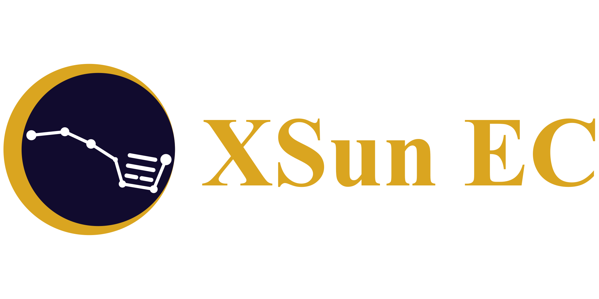
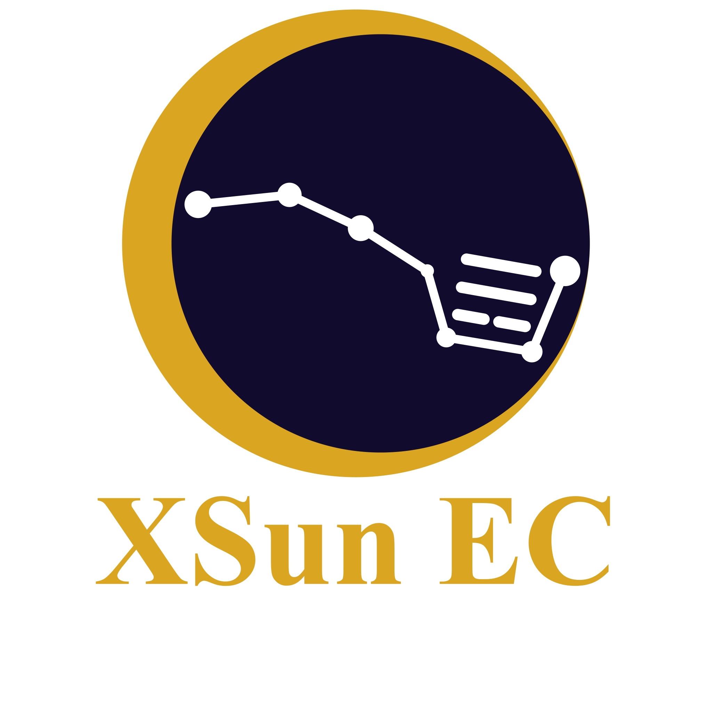
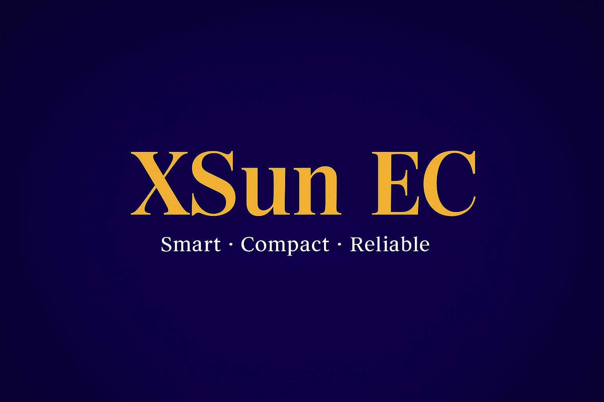

# 📚 XSunEC · BrandAssets — Overview Index

> Quick navigation · Unified entry point (SSOT)

  
  
<strong>Smart · Compact · Reliable solutions for modern living.</strong>

  
🌠<a href="https://xsunec.com" target="_blank">xsunec.com</a> · âœ‰ï¸ <a href="mailto:victor@xsunec.com">victor@xsunec.com</a> · 📠<a href="https://wa.me/14588368672" target="_blank">+1 458 836 8672</a>

---

## 🗂 Quick Links

- 🔷 **Main Repository README** → [README.md](./README.md)
- 🏷 **Badges** → [/logos/badges](./logos/badges)
- 🌟 **Main Logos** → [/logos/main](./logos/main)
- 🔶 **Symbols** → [/logos/symbols](./logos/symbols)
- 🪶 **Variants** → [/logos/variants](./logos/variants)
- 🖼 **Banners** → [/logos/banners](./logos/banners)

---

## 🖼 Preview Gallery

<table>
  <tr>
    <td align="center">
       Main Logos
    </td>
    <td align="center">
       Symbols
    </td>
    <td align="center">
       Variants
    </td>
  </tr>
  <tr>
    <td align="center">
       Badges
    </td>
    <td align="center">
       Banners
    </td>
    <td align="center">
      <a href="./README.md">Repo README</a> About · Licensing · Structure
    </td>
  </tr>
</table>

---

## 🧩 Licensing & Contact

All assets are © 2025–present **XSunEC Global Operations**.  
Usage terms are available in the main [README.md](./README.md).  
✉️ <a href="mailto:victor@xsunec.com">victor@xsunec.com</a> · 📞 <a href="https://wa.me/14588368672" target="_blank">+1 458 836 8672</a>
